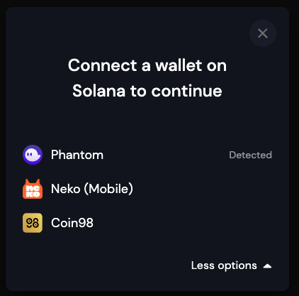

# Module `@nekoproject/wallet-adapter-neko`

Modular **Neko Wallet Adapters** and components for Solana applications.



## Quick Links

- [Quick Setup (using React UI)](#quick-setup-using-react-ui)
    + [Install](#install)
    + [Setup](#setup)
    + [Usage](#usage)
- [Build from Source](#build-from-source)
- [React demo](#run-react-demo)

### Install

Install these dependencies:

```shell
npm install @solana/wallet-adapter-base \
         @solana/wallet-adapter-react \
         @solana/wallet-adapter-react-ui \
         @solana/web3.js \
         react
```
Install neko wallet adapter
``` bash
    npm install @nekoproject/wallet-adapter-neko
```
### Setup

```tsx
import React, { FC, useMemo } from 'react';
import { ConnectionProvider, WalletProvider } from '@solana/wallet-adapter-react';
import { WalletAdapterNetwork } from '@solana/wallet-adapter-base';
import { NekoWalletAdapter } from '@nekoproject/wallet-adapter-neko'
import {
    WalletModalProvider,
    WalletDisconnectButton,
    WalletMultiButton
} from '@solana/wallet-adapter-react-ui';
import { clusterApiUrl } from '@solana/web3.js';

// Default styles that can be overridden by your app
require('@solana/wallet-adapter-react-ui/styles.css');

export const Wallet: FC = () => {
    // The network can be set to 'devnet', 'testnet', or 'mainnet-beta'.
    const network = WalletAdapterNetwork.Devnet;

    // You can also provide a custom RPC endpoint.
    const endpoint = useMemo(() => clusterApiUrl(network), [network]);

    // @nekoproject/wallet-adapter-neko includes the adapter for neko wallet
    // Only the wallets you configure here will be compiled into your application, and only the dependencies
    // of wallets that your users connect to will be loaded.
    const wallets = useMemo(
        () => [
            new NekoWalletAdapter() 
        ],
        [network]
    );

    return (
        <ConnectionProvider endpoint={endpoint}>
            <WalletProvider wallets={wallets} autoConnect>
                <WalletModalProvider>
                    <WalletMultiButton />
                    <WalletDisconnectButton />
                    { /* Your app's components go here, nested within the context providers. */ }
                </WalletModalProvider>
            </WalletProvider>
        </ConnectionProvider>
    );
};
```

### Usage

```tsx
import { WalletNotConnectedError } from '@solana/wallet-adapter-base';
import { useConnection, useWallet } from '@solana/wallet-adapter-react';
import { Keypair, SystemProgram, Transaction } from '@solana/web3.js';
import React, { FC, useCallback } from 'react';

export const SendOneLamportToRandomAddress: FC = () => {
    const { connection } = useConnection();
    const { publicKey, sendTransaction } = useWallet();

    const onClick = useCallback(async () => {
        if (!publicKey) throw new WalletNotConnectedError();

        const transaction = new Transaction().add(
            SystemProgram.transfer({
                fromPubkey: publicKey,
                toPubkey: Keypair.generate().publicKey,
                lamports: 1,
            })
        );

        const signature = await sendTransaction(transaction, connection);

        await connection.confirmTransaction(signature, 'processed');
    }, [publicKey, sendTransaction, connection]);

    return (
        <button onClick={onClick} disabled={!publicKey}>
            Send 1 lamport to a random address!
        </button>
    );
};
```
## Build from Source

1. Clone the project:
```shell
  https://github.com/docongminh/neko-wallet-adapter
```

2. Install dependencies:
```shell
cd neko-wallet-adapter
npm install
```

3. Build packages:
```shell
npm run build
```
## Run react demo
1. Install
```shell
cd react-ui-demo
npm install
```
2. Run
```shell
  npm run start
```

# Sources:
 - [solana-labs](https://github.com/solana-labs/wallet-adapter)
